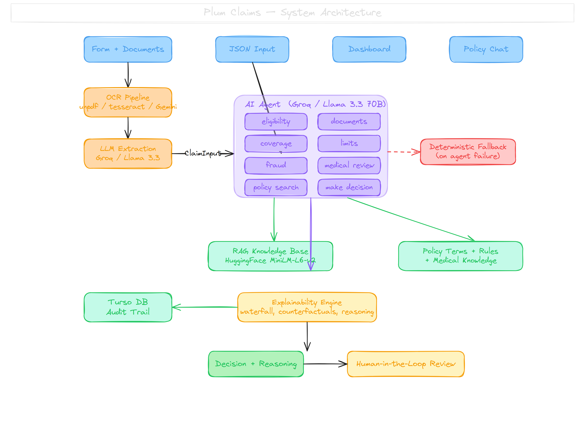
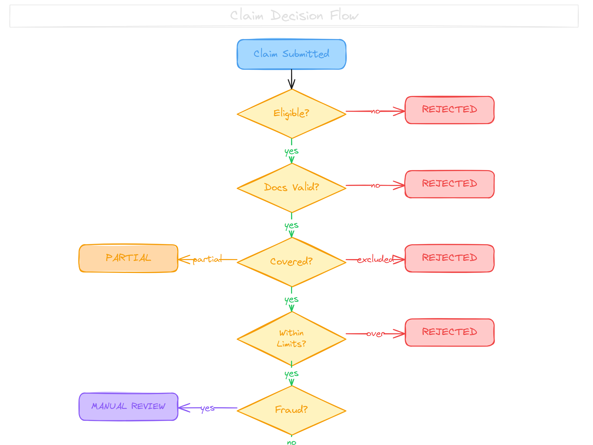

<div align="center">

# Plum OPD Claim Adjudication System

An AI-powered system that automates adjudication of Outpatient Department (OPD) insurance claims.
An LLM agent decides which checks to run, queries a policy knowledge base via RAG,
and produces a decision with full explainability and human-in-the-loop review.

[Live Demo](https://plum-claims-production.up.railway.app)

</div>

---

## Demo

### Claim Submission and Agent Decision

https://github.com/user-attachments/assets/4d431d18-7da6-4fbc-8025-6c36c5dd4321

<sub>Submitting an OPD claim with uploaded medical documents. The AI agent runs eligibility, document validation, coverage, limits, fraud detection, and medical necessity checks autonomously, then produces a decision with line-item breakdown and confidence score.</sub>

### Policy RAG Chat

https://github.com/user-attachments/assets/15872534-987e-45a6-9597-3a2316e2fe4f

<sub>Natural language Q&A against the policy knowledge base. The system retrieves relevant policy sections using semantic search (local HuggingFace embeddings) and answers questions about coverage, exclusions, limits, and claim requirements.</sub>

---

## Architecture



### Decision Flow



---

## Tech Stack

| Layer | Technology | Rationale |
|-------|-----------|-----------|
| Framework | Next.js 16, React 19, TypeScript | App Router with server/client components, API routes as backend |
| Styling | Tailwind CSS v4, shadcn/ui | Consistent design system with rapid iteration |
| AI Agent | Groq + Llama 3.3 70B via Vercel AI SDK | Free inference with tool-calling abstraction for the agentic loop |
| OCR | unpdf + tesseract.js + Gemini Vision | 3-tier: local PDF text, local image OCR, cloud fallback for low-confidence cases |
| Embeddings | HuggingFace transformers.js (all-MiniLM-L6-v2) | 384-dim vectors, runs on CPU, no API key required |
| Database | Turso (libSQL) + Drizzle ORM | Serverless SQLite with type-safe queries |
| Deployment | Railway | Persistent Node.js process — no serverless timeout limits for the agentic loop |

---

## Setup

### Prerequisites

- Node.js 20.9.0+
- A Groq API key (free) — [create one here](https://console.groq.com/keys)
- A Turso database — [create one here](https://turso.tech/) (or use `file:local.db` for local SQLite)
- Optional: Gemini API key for handwritten document OCR fallback — [create one here](https://aistudio.google.com/apikey)

### Installation

```bash
cd plum-claims
npm install
```

### Environment Variables

Create a `.env.local` file:

```bash
# Required — powers the AI agent, extraction, and medical review
GROQ_API_KEY=gsk_your_key_here

# Required — database
TURSO_DATABASE_URL=libsql://your-db.turso.io   # or file:local.db for local dev
TURSO_AUTH_TOKEN=your_turso_token

# Optional — additional Groq keys for rate limit rotation (3x free tier)
GROQ_API_KEY_2=gsk_second_key
GROQ_API_KEY_3=gsk_third_key

# Optional — use the 70B model for best quality (default: llama-3.1-8b-instant)
GROQ_MODEL=llama-3.3-70b-versatile

# Optional — Gemini Vision fallback for handwritten/blurry documents
GEMINI_API_KEY=your_gemini_key_here
```

The system works without a Gemini key (local OCR handles most documents). Without a Groq key, the deterministic rule engine still runs but without AI extraction or the agentic loop.

### Database Setup

```bash
npm run db:push
```

### Run

```bash
npm run dev
```

Open [http://localhost:3737](http://localhost:3737).

---

## Pages

| Page | URL | Description |
|------|-----|-------------|
| Dashboard | `/` | Claims list with metrics, approval rates, processing times |
| Submit Claim | `/submit` | Upload documents or paste structured JSON |
| Claim Detail | `/claims/[id]` | Amount waterfall, line items, agent reasoning, counterfactuals, review panel |
| Policy Explorer | `/policy` | Natural language Q&A against the policy (RAG-powered) |
| Test Runner | `/test-runner` | Run and visualize all 30 rule-engine test cases |
| Settings | `/settings` | Configure Groq API key at runtime |

---

## API

| Method | Path | Description |
|--------|------|-------------|
| `POST` | `/api/claims` | Submit a claim (multipart form or JSON), runs full adjudication |
| `GET` | `/api/claims` | List all claims, filterable by `status` and `member_id` |
| `DELETE` | `/api/claims` | Delete all claims |
| `GET` | `/api/claims/[id]` | Get full claim detail with parsed JSON fields |
| `POST` | `/api/claims/[id]/review` | Submit human review decision |
| `POST` | `/api/claims/[id]/appeal` | Submit appeal for rejected/partial claims |
| `POST` | `/api/rag/ask` | Natural language policy Q&A |
| `POST` | `/api/rag` | Raw vector search |
| `GET` | `/api/rag` | RAG knowledge base stats |
| `GET/POST` | `/api/settings` | Get or set Groq API key |
| `GET` | `/api/test-cases` | Run all 30 test cases |
| `POST` | `/api/test-cases` | Run a single test case |

---

## How the Agent Works

This is not a fixed pipeline with LLM calls attached. The AI agent autonomously decides its workflow:

- **Chooses which tools to call** based on the claim. A simple fever consultation may need 5 tool calls. A dental claim with cosmetic items triggers policy searches, coverage checks, and limit calculations across 10+ calls.
- **Reasons between steps.** When coverage returns `PARTIAL` with an adjusted amount, the agent passes that to `calculate_limits`. When a check returns `REJECT`, it stops and calls `make_decision` immediately.
- **Searches for knowledge.** The agent queries the RAG knowledge base at any point via `search_policy` when unsure about a rule.
- **Falls back gracefully.** If the agent fails (rate limit, timeout, malformed response), the system runs a deterministic 6-step pipeline with the same rules.

The agent is capped at 15 tool-call steps. After execution, deterministic post-processing reconciles the LLM's decision against actual tool results to correct any inconsistencies.

---

## OCR Pipeline

Medical documents come in many forms. The system uses a 3-tier approach:

1. **Digital PDFs** — `unpdf` extracts embedded text instantly, no API call
2. **Printed images** — `tesseract.js` runs OCR locally on the server
3. **Handwritten or low-quality** — Gemini 2.5 Flash Vision, only triggered when local confidence is below 55% or extracted text is under 80 characters

Roughly 80% of claims use zero API quota for OCR.

---

## Testing

### Rule Engine Test Suite

30 structured test cases validate the deterministic pipeline. Run them via the UI at `/test-runner` or from the command line:

```bash
npx tsx scripts/run-tests.ts
```

| ID | Scenario | Expected | Validates |
|----|----------|----------|-----------|
| TC001 | Simple consultation (fever) | APPROVED, Rs 1,350 | Co-pay deduction (10%) |
| TC002 | Root canal + teeth whitening | PARTIAL, Rs 8,000 | Cosmetic exclusion |
| TC003 | Gastroenteritis, Rs 7,500 | REJECTED | Per-claim limit (Rs 5,000) |
| TC004 | Missing prescription | REJECTED | Document validation |
| TC005 | Diabetes within 90 days | REJECTED | Specific ailment waiting period |
| TC006 | Ayurvedic treatment | APPROVED, Rs 4,000 | Alternative medicine coverage |
| TC007 | MRI without pre-auth | REJECTED | Pre-authorization required |
| TC008 | 3 claims same day | MANUAL_REVIEW | Fraud detection |
| TC009 | Weight loss treatment | REJECTED | Policy exclusion |
| TC010 | Apollo Hospital cashless | APPROVED, Rs 3,600 | Network discount (20%) |

Full list of all 30 cases (TC001-TC030) available in `test_cases.json`.

### Sample Documents

Generate realistic Indian medical PDFs for end-to-end testing:

```bash
npx tsx scripts/generate-test-docs.ts
```

Pre-made test images are available in `public/test-documents/` and can be uploaded directly via the Submit Claim page.

---

## Project Structure

```
src/
  lib/
    ai/
      agent.ts ............. Agentic adjudication (Groq/Llama + 9 tools)
      groq.ts .............. Groq client with key rotation
      ocr.ts ............... 3-tier OCR (unpdf, tesseract, Gemini)
      extract.ts ........... Document extraction + medical review
      rag.ts ............... In-memory vector store (HuggingFace embeddings)
      prompts.ts ........... Prompt templates with few-shot examples
      gemini.ts ............ Gemini Vision client
    engine/
      pipeline.ts .......... Deterministic 6-step adjudication pipeline
      eligibility.ts ....... Policy status, waiting periods
      documents.ts ......... Prescription, doctor registration validation
      coverage.ts .......... Exclusions, partial coverage, pre-auth
      limits.ts ............ Per-claim limits, copay, network discounts
      fraud.ts ............. Same-day frequency, high-value detection
      medical-review.ts .... AI medical necessity scoring
      explainability.ts .... Decision explanations, counterfactuals
    db/
      schema.ts ............ Drizzle schema (members + claims tables)
      seed.ts .............. Auto-seeds 30 test members on startup
    policy/
      terms.ts ............. Typed accessors for policy_terms.json
  app/
    api/claims/route.ts .... Claim submission + listing
    api/rag/ask/route.ts ... Policy Q&A endpoint
    submit/page.tsx ........ Claim submission UI
    claims/[id]/page.tsx ... Claim detail + review UI
    policy/page.tsx ........ Policy explorer UI
    test-runner/page.tsx ... Test runner UI
```

---

## Key Design Decisions

**Category-aware per-claim limits.** The general per-claim limit is Rs 5,000, but dental (Rs 10K), diagnostic (Rs 10K), and alternative medicine (Rs 8K) have their own sub-limits. An Rs 8,000 dental claim passes while an Rs 7,500 general claim is rejected.

**Copay on general claims only.** The 10% copay applies to consultation-type claims, not specialty categories. This produces Rs 1,350 for an Rs 1,500 fever consultation and Rs 4,000 for an Rs 4,000 Ayurvedic treatment.

**Confidence blending.** Final confidence = 60% rule engine clarity + 40% AI medical score. Below 70% triggers MANUAL_REVIEW regardless of the rule engine decision.

**Groq key rotation.** Up to 3 API keys with automatic rotation on 429 rate limits, effectively tripling the free tier quota.

**Railway over Vercel.** The agentic loop takes 15-30 seconds per claim. Railway runs a persistent Node.js process with no timeout limits, compared to Vercel's 10-second free tier limit on serverless functions.

---

## Deployment

| Component | Service | Details |
|-----------|---------|---------|
| App | Railway | Next.js 16, persistent Node.js process |
| Database | Turso | Cloud SQLite, 30 seeded members |
| LLM | Groq | Llama 3.3 70B (extraction, medical review, agent) |
| OCR Fallback | Google Gemini | 2.5 Flash Vision for low-quality documents |
| Embeddings | In-memory | MiniLM-L6-v2 loads on cold start |
| RAG | In-memory | Knowledge base rebuilt from source files on startup |

---

## Assumptions

1. **30 pre-seeded members** (EMP001-EMP030). Production would integrate with HR/policy systems.
2. **YTD tracking** defaults to 0. Production would calculate from historical claims.
3. **Doctor registration** is format-validated only (StateCode/Number/Year), not verified against an external registry.
4. **Network hospital matching** uses substring match. Production would use a provider ID lookup.
5. **Single policy** — operates against `policy_terms.json`. Multi-policy support would require policy selection at submission.
